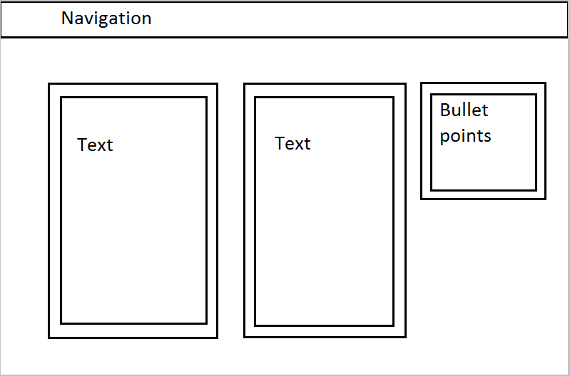

# Jessie Devine - MART 341, Final

For my final, I'm going to create a wesbite about plants. The homepage will be simple and sleek, with only a title and a navigation bar. The navigation bar will have an `about` button, a `contact` button, and a `habitat` button, which will result in a dropdown menu on hover which will offer `rainforest`, `temperate`, `desert`, `agricultural`, and `underwater` as options to choose from. Each habitat page will contain some cursory info and two links, one for a gallery and one to a page with more information about the plants in that habitat. I'd also like to incorporate sounds from the habitat on each habitat page.

Here's my site map:

Okay, updating this. This project turned out a bit more complicated than I anticipated but I am having a great time. I created wireframes for a desktop format, a tablet format, and a smartphone format. I had to do one for each page type but luckily some of them are repetitious. Here's the three I created for the homepage (they're basically the same).

<b>Desktop:</b>   
<b>Tablet:</b>   
<b>Mobile:</b>   

    
Next I moved on to my contact and about pages, and created three formats for each:

<B>About Desktop:</B>    
<B>About Tablet:</B>    
<B>About Mobile:</B> 

    
<B>Contact Desktop:</B>   
<B>Contact Tablet:</B>   
<B>Contact Mobile:</B>   

    
After I worked those out, I made wireframes for each of my plant pages. I have a "landing" page for when the user clicks on each habitat, and those look like this:  
<B>Landing Desktop:</B>   
<B>Landing Tablet:</B> )  
<B>Landing Mobile:</B> )  

  
I then created the gallery wireframes and the info pages, which look like this:  
<B>Info Desktop:</B> )  
<B>Info Tablet:</B> )  
<B>Info Mobile:</B> )  

  
The gallery ones change when you hover over the pictures (as the pictures grow) but I only created wireframes for the static page:
<B>Gallery Desktop:</B>   
<B>Gallery Tablet:</B>   
<B>Gallery Mobile:</B>   

  
The wireframes for the gallery ended up not being <I>exactly</I> what I did. It was hard to create the pictures that would grow on hover, so they ended up having to be all in one line on the static desktop page (rather than scattered over the background image as I initially imagined). The mobile on the info pages also came out a little askew, but I couldn't figure out how to get the bullet points to bump down to the bottom of the page instead of just getting squished. 
  
In terms of design, I made the plant theme pretty obvious on the home page, with green and white accents over a leafy background. On each secondary page, I kept the navigation and the format the same for consistency, but I changed the color scheme to match the habitat (slate gray for temperate, gold for desert, teal for underwater, etc.). Designing this was probably my favorite part.
  
I'm also very proud of the contact page. I had to use a little javascript to get my pop up box to work, and I'm super excited with how it turned out. If you select the "other" option from the habitat drop down menu, an editable text box pops up. This was complicated and I'm very proud of it, haha
  
Overall, I had a super fun time working on this project. It's definitely my favorite of the semester, and it challenged my skills more than anything else has.